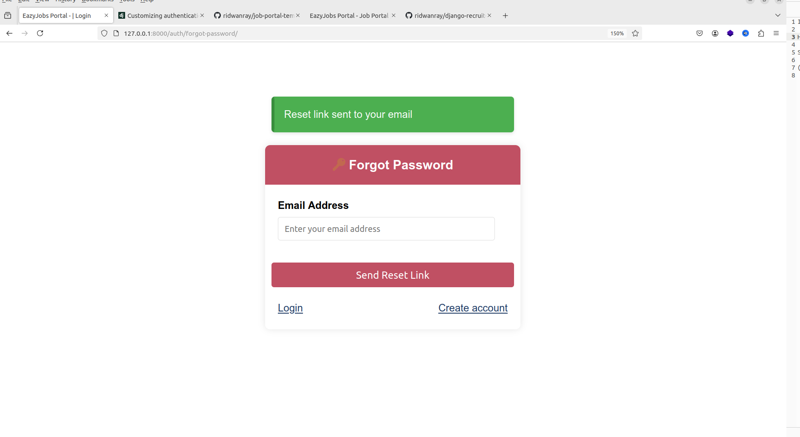
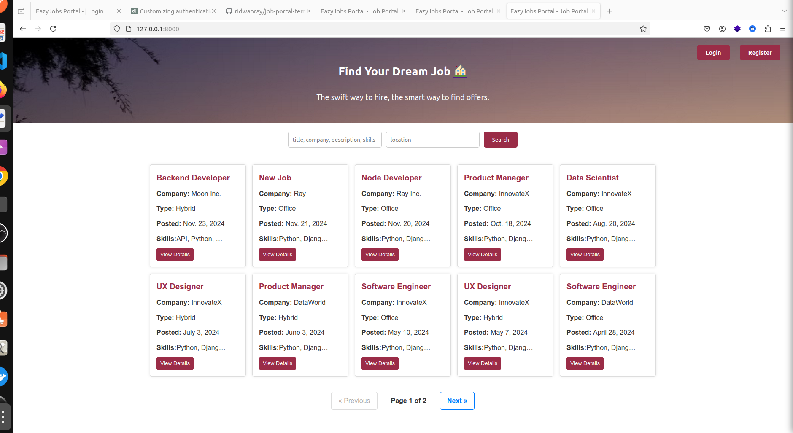

# Django Authentication & Authourization
Authentication & Authourization built with Django

# Tools & Services:
- Django : Python Web Framework
- Pytest: Testing Framework
- Celery: Task scheduling
- Flower: Task monitoring
- Redis: Celery broker
- SQLite: Relational DB
- Code Formatter: Black

# Features

- Login
- Register
- Account verification
- Password reset
- Sending email

# Running locally

Create a .env file by copying the .env.sample provided and run:


# Running In a VirtualEnv

Create a virtual environment using:
```
python3 -m venv venv
```

```
pip install -r requirements.txt
```

```
python manage.py makemigrations

python manage.py migrate
```

Run the server using:
```
python manage.py runserver
```

Celery worker
```
celery -A talent_base worker --loglevel=info
```
Flower dashboard
```
celery -A talent_base flower --ports=5555
```


# Run tests

Run tests in an activated virtualenv using:

```
pytest -v -rA
```

# Login


# Register


# Verify Account


# Reset password



# Home



# Flower dashboard


